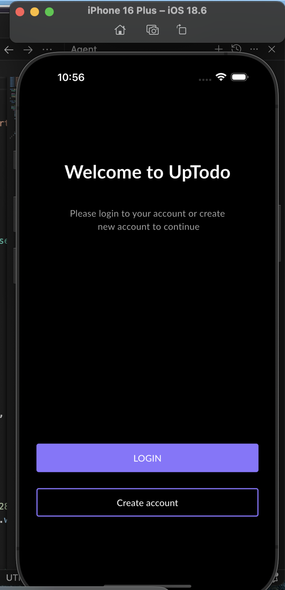
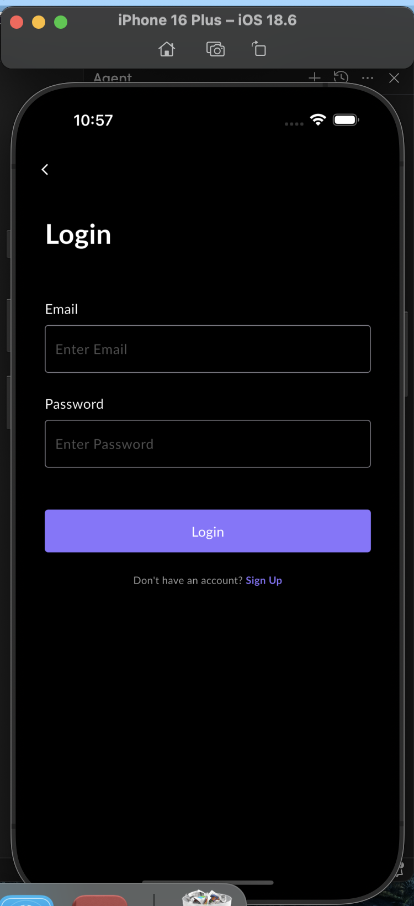
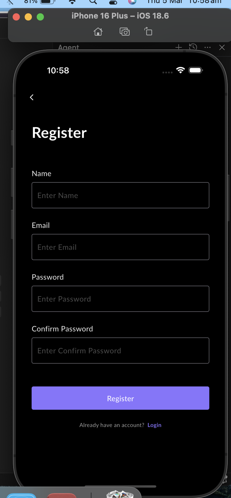
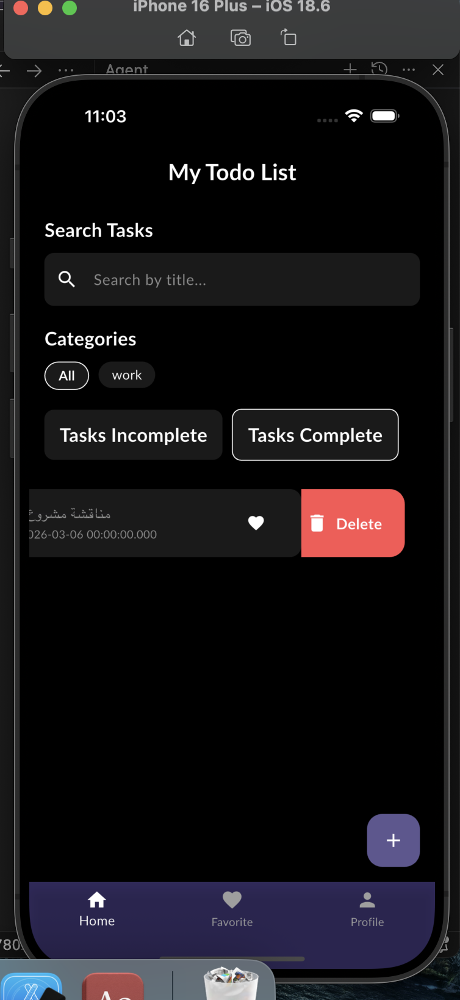
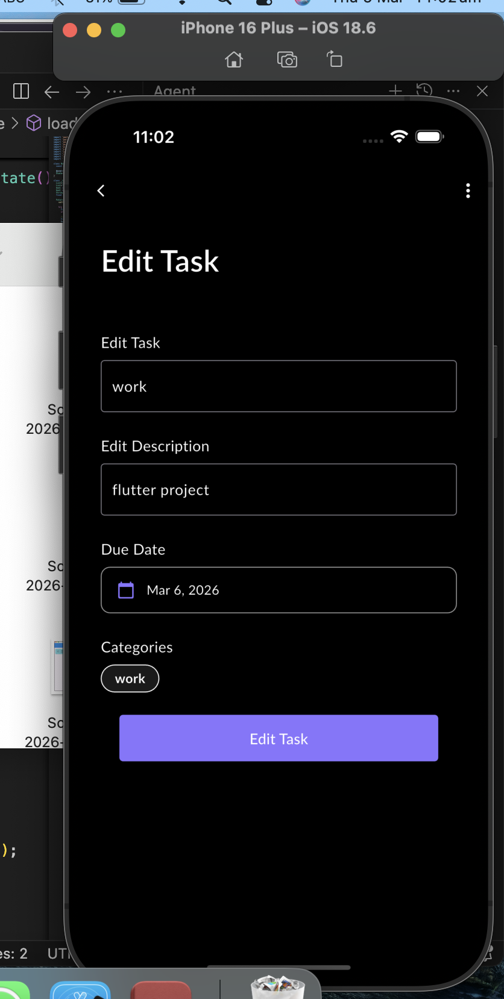
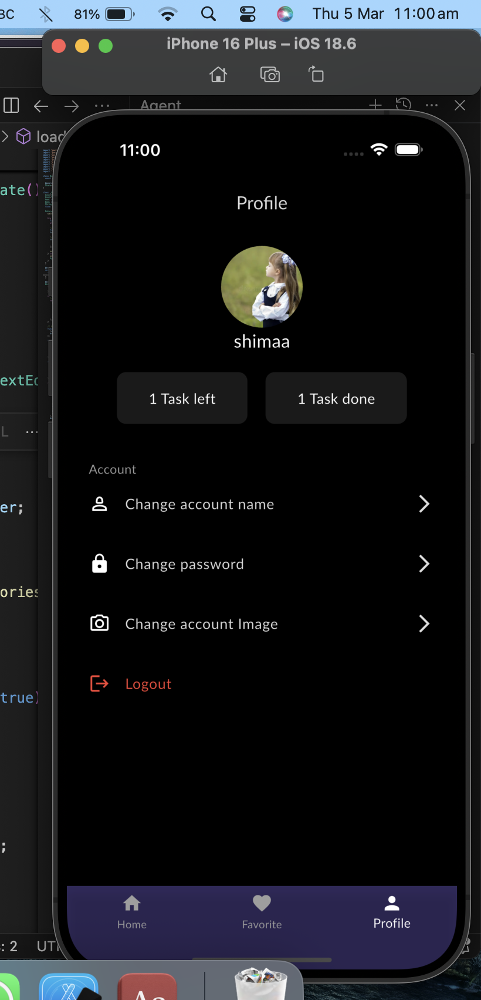
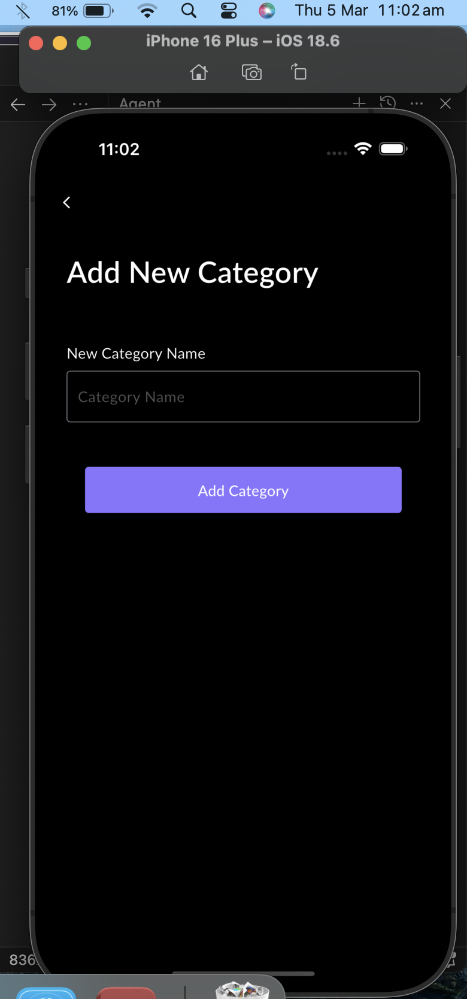

# UpTodo - Flutter Task Manager App

A full-featured, offline-first To-Do application built with Flutter and Firebase.

---

## 📱 Screenshots

<p align="center">
  
  
  
</p>

<p align="center">
  
  
  
</p>

<p align="center">
  
</p>

---

## ✨ Features

- ✅ Create, edit, delete, and complete tasks
- ⭐ Mark tasks as favorites
- 📁 Organize tasks into custom categories
- 🔍 Real-time search by title or description
- 📅 Due date picker for each task
- 🔄 Offline-first with automatic Firebase sync
- 🔐 Firebase Authentication (register & login)
- 👤 Profile management (name, password, photo)
- 💾 Local SQLite database (works without internet)

---

## 🛠️ Tech Stack

| Technology | Package | Purpose |
|---|---|---|
| Flutter | SDK | Cross-platform UI |
| GetX | `get ^4.7.3` | Navigation & state |
| SQLite | `sqflite ^2.4.2` | Local database |
| Firebase Auth | `firebase_auth ^5.0.0` | Authentication |
| Cloud Firestore | `cloud_firestore ^5.0.0` | Cloud sync |
| SharedPreferences | `shared_preferences ^2.5.4` | Session storage |
| connectivity_plus | `connectivity_plus ^6.0.3` | Network detection |
| image_picker | `image_picker ^1.1.2` | Profile photo |
| path_provider | `path_provider ^2.1.1` | Local file paths |

---

## 📁 Project Structure

```
lib/
├── core/
│   ├── db_helper.dart        # SQLite database operations
│   ├── sync_service.dart     # Background Firebase sync
│   └── theme_app.dart        # App colors & theme
├── model/
│   ├── task_model.dart
│   ├── category_model.dart
│   ├── user_model.dart
│   └── onboarding_model.dart
├── view/
│   ├── auth/
│   │   ├── login_screen.dart
│   │   └── signup_screen.dart
│   ├── home/
│   │   ├── home_screen.dart
│   │   ├── add_task_screen.dart
│   │   ├── add_category_screen.dart
│   │   ├── fav_task_screen.dart
│   │   ├── profile_screen.dart
│   │   └── main_screen.dart
│   └── intro/
│       ├── splash_screen.dart
│       ├── onboarding_screen.dart
│       └── Start_Screen.dart
├── widget/
│   ├── task_item.dart
│   ├── category_item.dart
│   ├── build_textfield.dart
│   ├── primary_button.dart
│   ├── app_snackbar.dart
│   ├── empty_task_widget.dart
│   └── onboarding_item.dart
├── firebase_options.dart
└── main.dart
```

---

## 🗄️ Database Schema

**tasks**
```sql
CREATE TABLE tasks (
  id          INTEGER PRIMARY KEY AUTOINCREMENT,
  title       TEXT,
  description TEXT,
  dueDate     TEXT,
  isCompleted INTEGER,
  isFavorite  INTEGER,
  categoryId  INTEGER,
  isSynced    INTEGER DEFAULT 0
)
```

**categories**
```sql
CREATE TABLE categories (
  id         INTEGER PRIMARY KEY AUTOINCREMENT,
  name       TEXT,
  isSelected INTEGER
)
```

**users**
```sql
CREATE TABLE users (
  id        TEXT PRIMARY KEY,
  name      TEXT,
  email     TEXT,
  imagePath TEXT
)
```

---

## 🚀 Getting Started

### Prerequisites

- Flutter SDK `^3.10.7`
- Dart SDK
- Firebase project configured
- Android Studio / VS Code

### Installation

1. **Clone the repository**
   ```bash
   git clone https://github.com/your-username/uptodo.git
   cd uptodo
   ```

2. **Install dependencies**
   ```bash
   flutter pub get
   ```

3. **Configure Firebase**
   - Create a Firebase project at [console.firebase.google.com](https://console.firebase.google.com)
   - Enable **Authentication** (Email/Password)
   - Enable **Cloud Firestore**
   - Run FlutterFire CLI to generate `firebase_options.dart`:
     ```bash
     dart pub global activate flutterfire_cli
     flutterfire configure
     ```

4. **Add assets**

   Make sure the following folders exist:
   ```
   assets/
   ├── images/
   │   ├── logo.png
   │   ├── profile.webp
   │   ├── empty_tasks.png
   │   └── Onboading1.png
   └── fonts/
       ├── Lato-Regular.ttf
       ├── Lato-Medium.ttf
       ├── Lato-Semibold.ttf
       └── Lato-Bold.ttf
   ```

5. **Run the app**
   ```bash
   flutter run
   ```

---

## 🔄 Sync Logic

The app follows an **offline-first** approach:

1. All task operations (create/update/delete) are saved to **SQLite first**
2. A Firestore sync is attempted immediately after
3. If offline, tasks are marked with `isSynced = 0`
4. `SyncService` listens for connectivity changes and auto-syncs pending tasks when the internet is restored

---

## 📱 App Flow

```
SplashScreen (3s)
    │
    ├── First launch?  ──→ OnboardingScreen ──→ StartScreen
    │
    ├── Not logged in? ──→ StartScreen ──→ Login / Signup
    │
    └── Logged in?     ──→ MainScreen (Home | Favorites | Profile)
```

---

## 🎨 Theme

| Element | Value |
|---|---|
| Primary Color | `#8875FF` |
| Background | `#000000` |
| Font | Lato |

---

## 📦 Dependencies

```yaml
dependencies:
  flutter:
    sdk: flutter
  cupertino_icons: ^1.0.8
  smooth_page_indicator: ^2.0.1
  shared_preferences: ^2.5.4
  intl: ^0.19.0
  get: ^4.7.3
  firebase_core: ^3.0.0
  firebase_auth: ^5.0.0
  sqflite: ^2.4.2
  cloud_firestore: ^5.0.0
  image_picker: ^1.1.2
  firebase_storage: ^12.0.0
  connectivity_plus: ^6.0.3
  path_provider: ^2.1.1
```

---

## 🤝 Contributing

1. Fork the project
2. Create your feature branch (`git checkout -b feature/AmazingFeature`)
3. Commit your changes (`git commit -m 'Add some AmazingFeature'`)
4. Push to the branch (`git push origin feature/AmazingFeature`)
5. Open a Pull Request

---

## 📄 License

This project is licensed under the MIT License.
